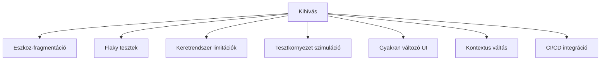
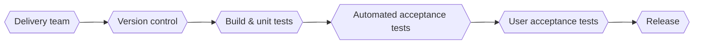

# Tesztautomatizálási kérdések

## Tesztelési alapok (ISTQB-hez kapcsolódó)

#### ✅ Mi a tesztelés célja? Mi nem az?

#### A tesztelés célja:
- Hibák felismerése: 
  - A tesztelés fő célja, hogy azonosítsa a szoftverben rejlő hibákat vagy anomáliákat.

- Minőségbiztosítás: 
  - A tesztelés segít a szoftver minőségének biztosításában, és megerősíti, hogy a rendszer a specifikációknak megfelelően működik.

- Megfelelőség ellenőrzése: 
  - Ellenőrzi, hogy a fejlesztett rendszer megfelel-e az üzleti követelményeknek, és hogy a felhasználói igényeknek is eleget tesz.

#### Mi nem a tesztelés célja:
- A szoftver biztosítéka: 
  - A tesztelés nem garantálja a hibamentességet, csak a hibák felfedezésére szolgál.

- Kódolás vagy fejlesztés helyettesítése: 
  - A tesztelés nem a kód megírását vagy a fejlesztési folyamatokat helyettesíti, hanem azok után következik.

- A fejlesztési hibák egyedüli forrása: 
  - A tesztelés nem célja az egyes fejlesztői hibák kiderítése, inkább a rendszer átfogó hibáinak feltárása.

##

#### ✅ Mik a tesztelési alapelvek?

1. A tesztelés hibákat mutat, nem a hibamentességet:  
    > A tesztelés kimutathatja a hibák jelenlétét, de soha nem garantálja, hogy a rendszer hibamentes. A hibamentesség igazolása nem lehetséges.  

2. Kimerítő tesztelés nem lehetséges:  
    > Minden lehetséges esetet lefedő tesztelés kivitelezhetetlen. Ehelyett a tesztelési erőforrásokat kockázatelemzéssel és prioritásokkal kell fókuszálni.  

3. Korai tesztelés előnyei:  
    > A hibák korai megtalálása időt és költséget takarít meg. Ezért a tesztelési tevékenységeket minél előbb, a fejlesztési életciklus elején el kell kezdeni.  

4. Hibafürtök jelensége:  
    > A hibák gyakran néhány modulban koncentrálódnak. A hibafürtök azonosítása segíthet a hatékonyabb tesztelésben.  

5. Féregirtó paradoxon:  
    > Az ismétlődő tesztek idővel kevésbé hatékonyak. Új hibák feltárásához a teszteket frissíteni, bővíteni kell.  

6. Tesztelés a körülmények függvényében:  
    > A tesztelési megközelítések a projektek jellegétől függően változnak, például biztonságkritikus rendszerekben más szempontok érvényesülnek, mint e-kereskedelmi alkalmazásokban.  

7. Hibamentesség mítosza:  
    > Minden hiba megtalálása és javítása sem garantálja a rendszer sikerét. Egy hiba nélküli, de nehezen használható rendszer is megbukhat a gyakorlatban.

##

#### ✅ Mi az egységtesztelés (unit testing)? Ki felelős az egységtesztek írásáért?

- Az egységtesztelés a szoftvertesztelés egy szintje, amelyben az alkalmazás legkisebb, önállóan tesztelhető egységeit ellenőrzik. Az egységtesztek célja annak biztosítása, hogy az egyes komponensek megfelelően működjenek a tervezett funkcióik szerint.

- Az egységtesztek írásáért általában a fejlesztők a felelősek, mivel ők rendelkeznek a legnagyobb ismerettel az adott modulok vagy komponensek belső működéséről. Az egységtesztelés gyakran a fejlesztési folyamat része, és sok esetben automatizáltan hajtják végre.

##

#### ✅ Mik a tesztszintek, és mi a különbség köztük?

#### A tesztszintek hierarchikus rendszerben vannak rendezve:

- Egységtesztelés (Unit Testing): 
  - A kód legkisebb egységeinek tesztelése.

- Integrációs tesztelés (Integration Testing): 
  - Különálló egységek összekapcsolása, hogy az együttműködésük megfelelő legyen.

- Rendszertesztelés (System Testing): 
  - Az egész rendszert tesztelik annak érdekében, hogy biztosítsák, hogy az megfeleljen az összes specifikációnak.

- Rendszer integrációs:
  - A rendszerintegrációs tesztelés a rendszerek és mikroszolgáltatások közötti kölcsönhatások, valamint külső szolgáltatások integrációjának tesztelésére összpontosít, és kihívásokkal járhat, mint például külső hibák kezelése.

- Elfogadási tesztelés (Acceptance Testing): 
  - A felhasználók által végzett tesztelés, amely azt ellenőrzi, hogy a rendszer megfelel-e az üzleti igényeknek.

##

#### ✅ Mi a különbség a verifikáció és a validáció között?

#### Verifikáció: 
- Az a folyamat, amely biztosítja, hogy a fejlesztett termék megfeleljen a tervezési specifikációknak és követelményeknek.

#### Validáció: 
- Az a folyamat, amely biztosítja, hogy a fejlesztett termék megfeleljen a felhasználói igényeknek és elvárásoknak.

##

#### ✅ Mik a tesztelési típusok, és mi a különbség köztük?

#### Funkcionális tesztelés: 
- A funkciók működését ellenőrzi, hogy a rendszer a specifikációnak megfelelően működik.

#### Nem-funkcionális tesztelés: 
- A rendszer teljesítményét, biztonságát, használhatóságát és más nem funkcionális tulajdonságait vizsgálja.

#### Fehér doboz tesztelés: 
- A tesztelő ismeri a kódot, és a belső működést ellenőrzi (pl. kódborítás).

#### Ellenőrző tesztelés tesztelés: 
- A tesztelő nem ismeri a kód belső struktúráját, és kizárólag a szoftver külső működését vizsgálja a bemenetek és kimenetek alapján.

#### Regressziós tesztelés: 
- A tesztelő részleges ismeretekkel rendelkezik a rendszer belső működéséről, és azokat az ismereteket felhasználva végzi el a tesztelést.

##

#### ✅ Mi a különbség a fehér doboz, szürke doboz és fekete doboz tesztelés között?

#### Fehér doboz tesztelés: 
- A tesztelő teljes hozzáféréssel rendelkezik a kódhoz és annak belső struktúrájához. A tesztelés célja a kód hibáinak megtalálása és az optimalizálás.

#### Szürke doboz tesztelés: 
- A tesztelő részleges hozzáféréssel rendelkezik a rendszer belső működéséhez. Különböző kód vagy konfigurációs információk alapján végezhet tesztelést.

#### Fekete doboz tesztelés: 
- A tesztelő nem ismeri a rendszer belső működését, csak a bemeneteket és kimeneteket vizsgálja.

##

#### ✅ Mi a különbség a felhasználói elfogadási teszt (UAT) és a rendszerteszt között?

#### UAT (User Acceptance Testing): 
- A végfelhasználók vagy az üzleti szereplők végzik, hogy biztosítsák, hogy a rendszer megfelel az üzleti követelményeknek. Ez a tesztelési fázis biztosítja, hogy a termék használható és elfogadható a felhasználók számára.

#### Rendszerteszt: 
- A rendszert mint egységet tesztelik, hogy az minden előírt specifikációnak megfeleljen, de nem feltétlenül foglalkozik az üzleti szempontokkal.

##

#### ✅ Sorolj fel különbségeket a regressziós tesztelés, a füsttesztelés és az újratesztelés között!

#### Regressziós tesztelés: 
- A szoftver frissítése vagy módosítása után végzik, hogy ellenőrizzék, hogy az új kód nem okozott-e hibát a rendszer korábban jól működő részein.

#### Füsttesztelés: 
- Az alapvető működés ellenőrzése, hogy a legfontosabb funkciók működnek-e egy új build után. Ez egy gyors, felületes teszt mely a stabilitást ellenőrzi.

#### Újratesztelés: 
- Az adott hibák javítása után annak biztosítása, hogy a hiba valóban megszűnt, és hogy a javítás nem hozott létre új problémát.

- Újratesztelés kizárólag a kijavított hibák tesztelésére vonatkozik, hogy biztosítsák a hibák valódi megoldását.

##

#### ✅ Mi a különbség a statikus és dinamikus tesztelés között?

#### Statikus tesztelés: 
- A kód futtatása nélkül végzik, és elsősorban kódelemzésen, dokumentációellenőrzésen és követelmény-ellenőrzésen alapul.

#### Dinamikus tesztelés: 
- A kód futtatásával történik, és a rendszer viselkedését teszteli a működés közben, hibák és anomáliák keresésével.

##

### ✅ Hasonlítsd össze a V-modellt, a vízesés modellt és az Agile megközelítést a tesztelés szempontjából!

V-modell: 
- A tesztelés a fejlesztési fázisokkal párhuzamosan halad. Minden egyes fejlesztési szakaszhoz kapcsolódik egy megfelelő tesztelési fázis. A tesztelés szisztematikusan, szigorúan követi a fejlesztést.

Vízesés modell:
- A fejlesztési fázisok lineárisan következnek egymás után. A tesztelés csak a fejlesztési fázis befejezése után történik.

Agile megközelítés: 
- A tesztelés folyamatos és iteratív folyamat, amely minden sprintben és iterációban jelen van, így gyorsabb és rugalmasabb a változások kezelésében.
##

   

## Reporting, Bugs

#### ✅ Milyen lépéseket követnél egy hiba megtalálásakor?
- Hiba észlelése
  - A tesztelés során a teszteset eredményét összevetjük az elvárt eredménnyel. Ha eltérés tapasztalható, azt hibának tekintjük.
- Hiba dokumentálása (hibajegy létrehozása) ->
Rögzítjük a hibát egy hibakövető rendszerben.
  - Részletezzük:
    > milyen környezetben történt,a hiba pontos leírása,hogyan lehet reprodukálni,
képernyőképek, naplók, verziószám stb.
- Hiba elemzése és osztályozása
  - Megállapítjuk a hiba súlyosságát és prioritását.
Azonosítjuk, hogy melyik komponens vagy fejlesztő felelős.
- Hiba továbbítása fejlesztőknek
  - A hibát kijavításra továbbítjuk, megfelelő prioritással és minden szükséges információval.
- Hiba kijavítása és ellenőrzése (retesztelés):
  - A fejlesztő kijavítja a hibát.
A tesztelő újra lefuttatja a tesztesetet (ellenőrző teszt), hogy meggyőződjön a javítás sikerességéről.
- Regrssziós tesztelés
  - Ellenőrizzük, hogy a hiba javítása nem okozott új hibát más funkciókban.
- Hibajegy lezárása:
  - Ha a hiba javítása megerősítést nyer, a hibajegyet lezárják.

##

#### ✅ Beszélj a gyakori tesztjelentésekről és részleteikről!

#### Az elvégzett tesztelés összefoglalása:
- Tájékoztatás a tesztelési időszak alatt történtekről
- Eltérések a tervtől, beleértve a tesztelési tevékenységek ütemtervét, időtartamát vagy a ráfordításokat
- A tesztelés és a termékminőség állapota a kilépési kritériumok vagy a „kész” definíciójának
tekintetében
- Azok a tényezők, amelyek blokkolták vagy továbbra is blokkolják a haladást
- A hibák, a tesztesetek, a teszt lefedettség, a tevékenység előrehaladása és az erőforrás-fogyasztás
mérőszámai
- A fennmaradó kockázatok
- Újrahasznosítható tesztelési munkatermékek

##

#### ✅ Mit tartalmaz egy hibajelentés?

#### A dinamikus tesztelés során létrehozott hibajelentés általában a következőket tartalmazza:
- Azonosító
- A bejelentett hiba címe és rövid összefoglalása
- A hibajelentés dátuma, a kibocsátó szervezet és a szerző
- A tesztelem (az éppen tesztelt konfigurációs elem) és a környezet azonosítója
- A fejlesztési életciklus fázisa(i), amelyben a hibát észlelték
- A hiba reprodukálását és megoldását lehetővé tevő leírás, beleértve a naplófájlokat, az adatbázis-
mentéseket, képernyőképeket vagy felvételeket (ha volt ilyen a teszt végrehajtása során)
- Elvárt és tényleges eredmények
- A hiba súlyosságának (severity) hatóköre vagy mértéke az érdekelt felek érdekeit tekintve
- A javítás sürgőssége/prioritása
- A hibajelentés állapota (pl. nyitott, elhalasztott, duplikált, megoldásra váró, ellenőrző tesztelésre váró,
újranyitva, lezárt)
- Következtetések, ajánlások és jóváhagyások
- Globális problémák, például olyan területek, amelyekre a hibából eredő változás hatással lehet
- Változási előzmények, mint például a projektcsapat tagjai által a hibával kapcsolatos lépések, hogy
elkülönítsék, javítsák és ellenőrizzék azt
- Hivatkozások, beleértve a problémát feltáró tesztesetet is

##

#### ✅ Hogyan rangsorolnál egy hibát?
 - kritikus -> pl. rendszer összeomlik
 - magas -> pl. funkció hibásan működik
 - közepes -> pl. egy funkció nem működik, de nem minden felhasználót érint.
 - alacsony -> pl. kisebb esztétikai hiba

##

## Test Automation, Selenium

#### ✅ Melyik teszteseteket érdemes automatizálni és melyiket nem?

- #### Automatizálásra alkalmasak:
  - Gyakran ismétlődő tesztek (pl. regressziós tesztek)
  - Nagy adatállományon futó tesztek (pl. teljesítménytesztek)
  - Stabil, ritkán változó funkciók
  - Időigényes manuális tesztek
  - Több konfiguráción (pl. böngészőn) ismétlődő tesztek
  - Objektíven értékelhető eredményekkel rendelkező tesztek

- #### Általában nem érdemes automatizálni:
  - Egyszer lefutó vagy ritkán ismételt tesztek
  - Gyorsan változó felületű vagy logikájú funkciók
  - Nagyon komplex tesztek, amelyek automatizálása aránytalanul drága
  - Szubjektív értékelésű tesztek (pl. vizuális megjelenés, UX)
  - Felfedező tesztek

##

#### ✅ Írj le egy jó automatizált tesztet!

| Tulajdonság                  | Leírás |
| - | - |
| **Megbízható**               | A helyes eredményt adja minden futtatásnál, ha nem történt változás.    |
| **Karbantartható**           | Könnyen módosítható a rendszer változása esetén.                        |
| **Gyorsan fut**              | Nem fogja vissza a fejlesztési ciklust.                                 |
| **Önállóan futathazó**       | Nem függ más tesztektől – önállóan lefuttatható.                        |
| **Jól dokumentált**          | Érthető, mit tesztel és miért – neve, kommentek, szerkezet.             |
| **Hasznos visszajelzést ad** | Hibás működés esetén pontos hibaüzenetet ad, nem csak FALSE-t vagy FAIL-t.         |

##

#### ✅ Mi a Selenium, Selenium IDE és Selenium WebDriver?
- A Selenium webalkalmazások automatikus tesztelésére szolgáló keretrendszer. Ez széles körben használható eszköz és az egyik legismertebb nyílt forrású teszteszköz. 

- A Selenium IDE egy nyílt forráskódú tesztautomatizálási eszköz, amely rögzítheti és lejátszhatja az interneten végzett műveleteit. Használatával automatizálhatja a webalkalmazások tesztelését.

- A Selenium WebDriver egy webes keretrendszer, amely lehetővé teszi a böngészők közötti tesztek végrehajtását. Ez az eszköz a webalapú alkalmazások tesztelésének automatizálására szolgál annak ellenőrzésére, hogy az elvárt módon működik-e. A Selenium WebDriver lehetővé teszi a programozási nyelv kiválasztását tesztszkriptek létrehozásához.

##

#### ✅ Hogyan lehet azonosítani a webes elemeket?
- **ID** → Egyedi azonosító pl. `id="submit"`
- **Name** → Név pl. `name="email"`
- **Class** → Osztály pl. `class="button primary"`
- **XPath** → Útvonal pl. `//div[@id='login']//button`
- **CSS Selector** → Stílusalapú pl. `div.container > input[type='text']`

##

#### ✅ Hogyan lehet várni az elemekre, és mi lehet a probléma? Gyűjtsd össze a lehetséges hibákat és okokat!

✅ **Hogyan lehet várni a webes elemekre + tipikus hibák és okaik**

###  Várakozás módszerei
- **Implicit wait** → Globálisan beállított alapvárakozás minden elemre.
- **Explicit wait** → Meghatározott feltételre (pl. láthatóság, kattinthatóság) várunk.
- **Fluent wait** → Explicit wait + polling idő + kivételek kezelése.

###  Tipikus problémák és hibák
- **Elem nem található (NoSuchElementException)**  
  → Elem nincs a DOM-ban vagy még nem töltődött be.

- **Elem nem látható / rejtett (ElementNotVisibleException)**  
  → Elem ott van, de nem látszik (pl. display: none, átfedés).

- **Időzítési problémák**  
  → Az oldal lassan töltődik, várakozás túl rövid.

- **Változó oldalelemek (stale element)**  
  → Elem időközben újratöltődött, referenciája érvénytelen.

- **Hibás selector**  
  → Rosszul megírt XPath/CSS selector, rossz elemre hivatkozás.

- **Átfedő elemek (pl. loader, popup)**  
  → Más elem takarja a célelemet, ezért nem érhető el.

##

#### ✅ Hasonlítsd össze a POM és a Keyword Driven Testing megközelítéseket!

- A POM a felhasználói felület elemeivel való interakcióra összpontosít, míg a kulcsszóvezérelt tesztelés az alkalmazáson végzett magas szintű műveletekre összpontosít. Együtt használhatók a robusztusabb tesztelési megközelítés érdekében. 
- Bonyolultság és kódolás: A POM több kódolási képességet igényel, így összetettebb, de rugalmasabb.

##

#### ✅ Mi a különbség a TDD és BDD között?

- A TDD elsősorban az egységtesztekre és a kód funkcionalitására összpontosít
- A BDD a rendszer viselkedésére és az érdekelt felekkel való együttműködésre helyezi a hangsúlyt
- > Az ATDD az elfogadási kritériumokon keresztül hangolja össze a fejlesztést a felhasználói követelményekkel.

##

#### ✅ Mi az API tesztelés és miért hasznos?

- Az API-tesztelés döntő szerepet játszik az alkalmazások megbízhatóságának, teljesítményének és biztonságának biztosításában, különösen egy olyan világban, amely egyre inkább az összekapcsolt szolgáltatásokra támaszkodik. Az API-k tesztelése számos külön előnyt kínál, így a modern fejlesztési és minőségbiztosítási gyakorlatok elengedhetetlen részévé válik.

##

#### ✅ Mi az adatvezérelt tesztelés és miért hasznos?

-  Lehetővé teszi a tesztelők számára, hogy egyetlen teszten belül több adatcsomagot kezeljenek. Ugyanaz a tesztszkript különböző bemenetekkel futtatható azáltal, hogy az adatokat elkülönítik a tesztszkriptektől. Ez a megközelítés időt takarít meg, és hatékonyabbá teszi a teszteredmények előállítását.

## 

#### 
 [Solid Principles robot explanation](https://medium.com/backticks-tildes/the-s-o-l-i-d-principles-in-pictures-b34ce2f1e898) 

##

#### ✅ Mik a kihívások és ajánlott eljárások a dinamikusan betöltött webes elemekkel?

**Kihívások:**
-  **Aszinkron betöltés kezelése**  
  Az elemek nem egyszerre töltődnek be, ezért nehéz lehet biztosítani, hogy minden szükséges adat vagy elem elérhető legyen egy adott pillanatban.

-  **Tesztelési nehézségek**  
  Automatizált tesztek (pl. Selenium) gyakran elbuknak, mert az elemek még nem láthatók vagy nem aktívak a DOM-ban a teszt futásakor.

-  **Teljesítményproblémák**  
  Túl sok dinamikus hívás (pl. API-k) lassíthatja a felhasználói élményt.

- **Reszponzív és kompatibilitási kérdések**  
  Dinamikus elemek eltérően jelenhetnek meg különböző eszközökön vagy böngészőkben.

**Ajánlott eljárások:**
-  **Betöltési állapotok kezelése (loading states)**  
  Használj „loading” indikátorokat, hogy jelezd a felhasználónak, ha tartalom még töltődik.

-  **Várakozások a tesztekben**  
  Automatizált teszteknél építs be explicit vagy implicit várakozásokat, amíg az elemek megjelennek.

-  **Lazy loading és optimalizálás**  
  Csak azt töltsd be, amire tényleg szükség van, és használj cache-elést az ismételt hívások elkerülésére.

-  **Hibatűrés és fallback megoldások**  
  Ha egy API-hívás vagy elem betöltése hibázik, jeleníts meg alternatív üzenetet vagy tartalmat.

-  **Rendszeres böngészőtesztelés**  
  Teszteld az oldaladat több böngészőn és eszközön, hogy az eltéréseket időben lásd.

#### ✅ Mik a mobil tesztautomatizálás kihívásai?

#### 1. **Eszköz- és OS-fragmentáció**  
- **10 000+ különböző eszköz** (kijelzőméretek, processzorok, RAM)  
- **OS-verziók eltérései** (pl. Android 8-14, iOS 14-17)  
- *Megoldás:* Cloud-based eszközfarmok (Firebase Test Lab, BrowserStack)

#### 2. **Flaky (Inkonzisztens) Tesztek**  
- **20-40% false failure rate** (nem determinisztikus viselkedés)  
- Okok: Hálózati latencia, animációk, háttérfolyamatok  
- *Megoldás:* Explicit waits, retry mechanizmusok, elemek detektálása (pl. `waitForElement`)

#### 3. **Keretrendszer-limitációk**  
- **Platformspecifikus eszközök:**  
  - iOS: Korlátozott Xcode/simulátor API (pl. háttérfolyamatok)  
  - Android: Accessibility issue-k (TalkBack kompatibilitás)  
- *Megoldás:* Hibrid megközelítés (Appium + platformnatív eszközök)

#### 4. **Tesztkörnyezet szimulációja**  
- Valós helyzetek nehéz reprodukálni:  
  - GPS helyváltoztatás  
  - Alacsony hálózati sebesség  
  - Értesítések megszakítják a folyamatot  
- *Megoldás:* Mockoló eszközök (Android Emulator lokáció spoofing)

#### 5. **UI-folyamatok gyakori változása**  
- **2-4 hetes release ciklusok** → törött tesztek  
- *Megoldás:*  
  - Page Object Model (POM) architektúra  
  - Accessibility ID-k prioritizálása  

#### 6. **Natív/Hibrid/Webview kontextusváltás**  
- **Webview elemek nem elérhetők** natív kontextusban  
- *Példa:* Bejelentkezés Facebook/Google fiókkal  
- *Megoldás:* Kontextus explicit váltás (pl. Appium `switch_context`)

#### 7. **CI/CD Integráció komplexitása**  
- Emulátorok/szimulátorok kezelése szerveren  
- **iOS buildhez macOS hardver kötelező**  
- *Megoldás:* Dockerizált iOS build (szolgáltatók: Bitrise, CircleCI)

##

## Haladó témák

##

#### ✅ Mi a különbség a CI és CD között?
- CI:
    > A Folyamatos Integráció (CI) egy olyan szoftverfejlesztési gyakorlat, amelyben a fejlesztők rendszeresen integrálják kódmódosításaikat egy közös tárolóba, majd automatikus buildelési és tesztelési folyamatok futnak le annak érdekében, hogy gyorsan felismerjék az integrációs problémákat.
- CD:
    > A Folyamatos Kézbesítés (CD) egy olyan szoftvermérnöki megközelítés, amelynek célja, hogy a szoftvermódosításokat gyorsan és megbízhatóan juttassák el az éles (production) környezetbe.
##

#### ✅ Írj le egy Continuous Delivery folyamatot!

 

#### ✅ Hasonlítsd össze két népszerű CI rendszert, ezek közül az egyik legyen a Jenkins!

### ✅ Jenkins vs. GitLab CI Összehasonlítás  

#### 1. **Architektúra & Beállítás**  
| **Jenkins** | **GitLab CI** |  
|-------------|---------------|  
| Önálló, szerveralapú Java alkalmazás. Manuális telepítés/szerver konfiguráció szükséges. | Integrált a GitLab platformba. Zero-config a GitLab projektekhez (`.gitlab-ci.yml` elég). |  
| **Flexibilitás:** Pluggable architektúra (1 800+ plugin). | **Egyszerűség:** Beépített funkciók (Docker integráció, Kubernetes, cache). |  

#### 2. **Konfiguráció**  
| **Jenkins** | **GitLab CI** |  
|-------------|---------------|  
| UI vagy `Jenkinsfile` (Groovy). Komplex pipeline-okhoz kódírás szükséges. | YAML alapú (`.gitlab-ci.yml`). Deklaratív szintaxis, könnyű tanulni. |  
| **Példa:** Scripted pipeline komplex logikához. | **Példa:** Alapvető build tesztelés 10 sorban. |  

#### 3. **Skálázhatóság**  
| **Jenkins** | **GitLab CI** |  
|-------------|---------------|  
| Szerver-függő: Master + Worker node-ok (manuális skálázás). | Cloud-native: Auto-scaling GitLab Runner-ökkel (AWS, GCP, K8s integráció). |  
| **Erősség:** Nagyon nagy projektek (pl. bankrendszerek). | **Erősség:** Dinamikus terheléskezelés felhőben. |  

#### 4. **Integrációk**  
| **Jenkins** | **GitLab CI** |  
|-------------|---------------|  
| **Plugin-ök:** Mindenhez van (Jira, Docker, Slack), de verziókonfliktusok gyakoriak. | **Natív támogatás:** Kubernetes, Terraform, SAST/DAST biztonsági szkennelés. |  
| Külső eszközökhöz kell csatlakoztatni. | Egy platform (kód, CI/CD, issue tracking, container registry). |  

#### 5. **UI & Monitoring**  
| **Jenkins** | **GitLab CI** |  
|-------------|---------------|  
| Funkcionális, de túlterhelt és időtálló kinézet. | Modern, áttekinthető pipeline-vizualizáció. |  
| Log elemzés nehézkes. | Real-time logok, teszteredmények, artifact letöltés UI-ból. |  

#### 6. **Árazás**  
| **Jenkins** | **GitLab CI** |  
|-------------|---------------|  
| **Nyílt forrás:** Ingyenes, de szerverköltség + adminisztráció. | **Freemium:** Ingyenes privát repo-k (400 perc/hó). Prémium: Auto DevOps, biztonsági jelentések ($19/felhasználó/hó). |  

#### ✅ Mi a Docker és miért hasznos?
- Konténerizációs platform:
  > alkalmazásokat és függőségeiket önálló, izolált egységekbe ("konténerekbe") csomagolja.

Fő előnyök:
1. 
- Konténerek = konzisztens környezet fejlesztéstől élesig.
- Példa: Ha működik a konténer a fejlesztő gépen, működni fog teszt/prod környezetben is.

2. Gyorsabb CI/CD folyamatok
- Konténerek másodpercek alatt elindulnak (vs. VM percek).
- Automatikus build/deploy pipeline-ok (pl. GitLab CI + Docker).

3. Erőforrás-hatékonyság
- Nincs felesleges OS terhelés: 1 szerveren több száz konténer futhat.
- Kevesebb RAM/CPU felhasználás.

4. Izoláció & biztonság
- Egyik konténer hibája nem hat másikra.
- Finomhangolt hozzáférés-vezérlés (Linux namespaces, cgroups).

5. Könnyű skálázhatóság
- Horizontális skálázás: docker-compose scale web=5 → 5 példány indul.
- Orchestrátorokkal (Kubernetes) automatikus terhelésalapú skálázás.